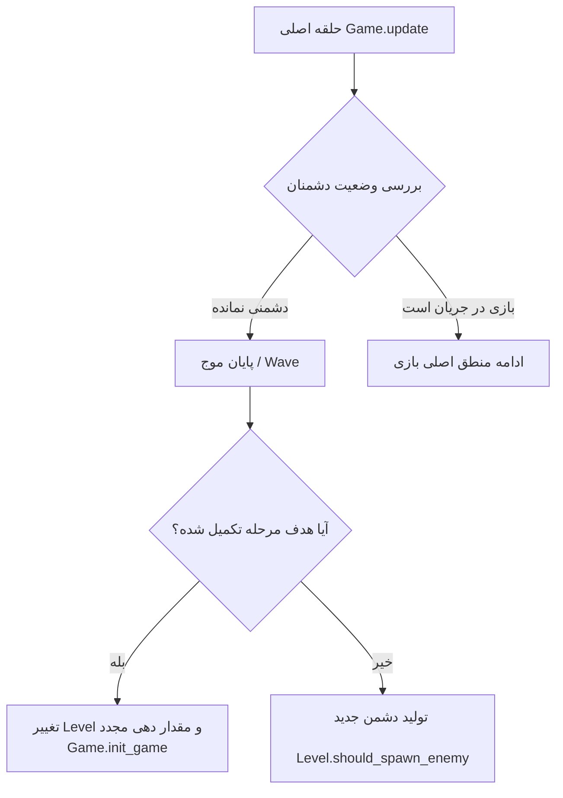
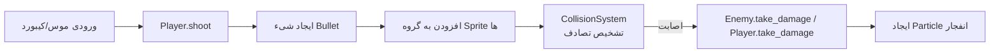
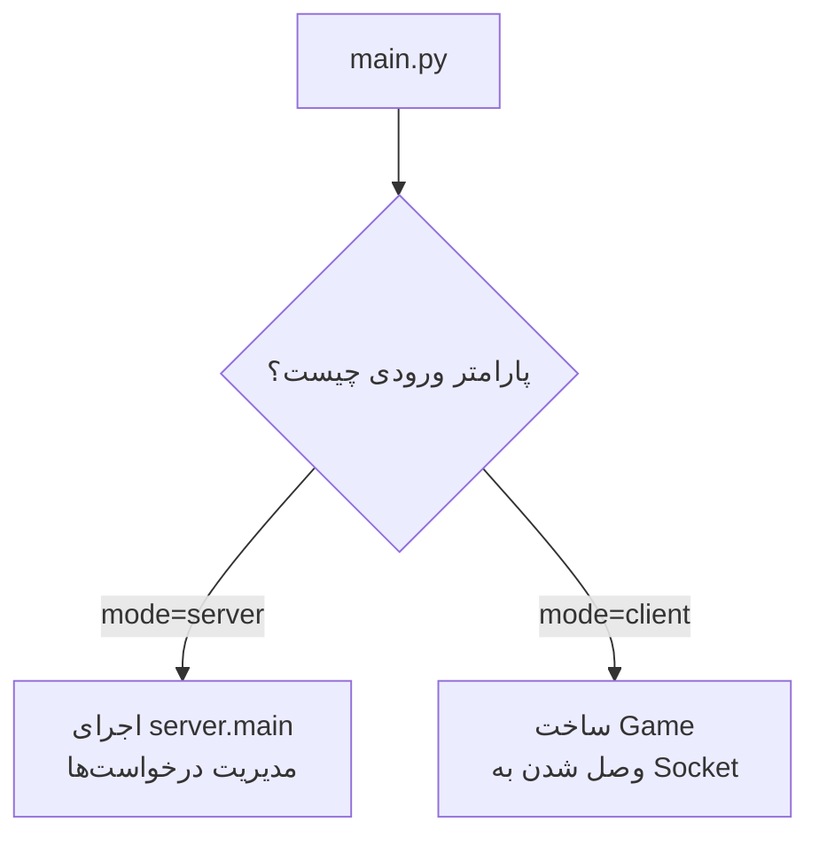

# 🚀 راهنمای تصویری و ساختاری کدهای بازی (Space Defender)

این فایل به عنوان یک **نقشه راه (Visual Explorer)** برای شما و بازبینِ کد (Code Reviewer) طراحی شده است. هر زمان که بازبین از شما خواست تا یک ویژگی خاص (مثل رفتن به مرحله بعد، شلیک کردن یا برخوردها) را توضیح دهید، کافی است به این فایل مراجعه کرده و با توجه به نمودارها، مستقیم روی کد مربوطه کلیک کنید.

*(در محیط VS Code کافی است دکمه `Ctrl` را نگه داشته و روی هر لینک کلیک کنید)*

---

## 🎮 نمودار جریان اصلی بازی (Game Loop & Leveling)
این فلوچارت نشان می‌دهد که منطق آپدیت بازی و نحوه پیشروی به مرحله بعد چگونه برنامه‌ریزی شده است. اگر بازبین پرسید: *"بازیکن چطور به مرحله بعد می‌رود؟"* این قسمت را نشان دهید:

### 🔗 لینک‌های مستقیم به کدهای مرحله و حلقه بازی:
* **کلاس مدیریت اطلاعات مرحله (تعداد دشمن، زمان، و...):** [core/game.py:L31](core/game.py#L31)
* **تابع بررسی برای تولید دشمن جدید در مرحله:** [core/game.py:L57](core/game.py#L57)
* **تابع مقداردهی و ریست کردن مرحله جدید:** [core/game.py:L911](core/game.py#L911) (تابع `init_game`)
* **متد اصلی آپدیت در حلقه بازی:** [core/game.py:L1161](core/game.py#L1161) (تابع `update`)

---

## 💥 سیستم شلیک و تصادفات (Shooting & Collisions)
اگر بازبین پرسید: *"وقتی کاربر شلیک می‌کند چطور تیرها به دشمن برخورد کرده و جانشان کم می‌شود؟"*

### 🔗 لینک‌های مستقیم به کدهای مبارزه:
* **تابع ایجاد شلیک بازیکن:** [entities/player.py:L228](entities/player.py#L228)
* **تابع کاهش جان بازیکن در هنگام برخورد:** [entities/player.py:L305](entities/player.py#L305)
* **کلاس مرکزی تشخیص انواع برخوردها (مستطیلی، دایره‌ای):** [systems/collision_system.py:L8](systems/collision_system.py#L8) 
* **تابع بررسی برخورد لیست تیرها با دشمنان:** [systems/collision_system.py:L50](systems/collision_system.py#L50) 

---

## 📡 شبکه و سرور (Network / Multiplayer)
برای توضیح مکانیزم ورود بازیکن به بخش شبکه و سرور:

### 🔗 لینک‌های مستقیم به شبکه:
* **نقطه ورود خط فرمان (شروع کلاینت یا سرور):** [main.py:L17](main.py#L17)
* **تابع اصلی لوپ سرور شبکه:** [server.py:L356](server.py#L356)

---

## 💾 ذخیره‌سازی و پروفایل‌ها (Save & Profile System)

### 🔗 لینک‌های مستقیم به دیتای بازیکن:
* **ساختار داده پروفایل (مشخصات قابل سیو):** [systems/save_system.py:L15](systems/save_system.py#L15)
* **کلاس مدیریت فایل سیو و رمزنگاری:** [systems/save_system.py:L258](systems/save_system.py#L258)
