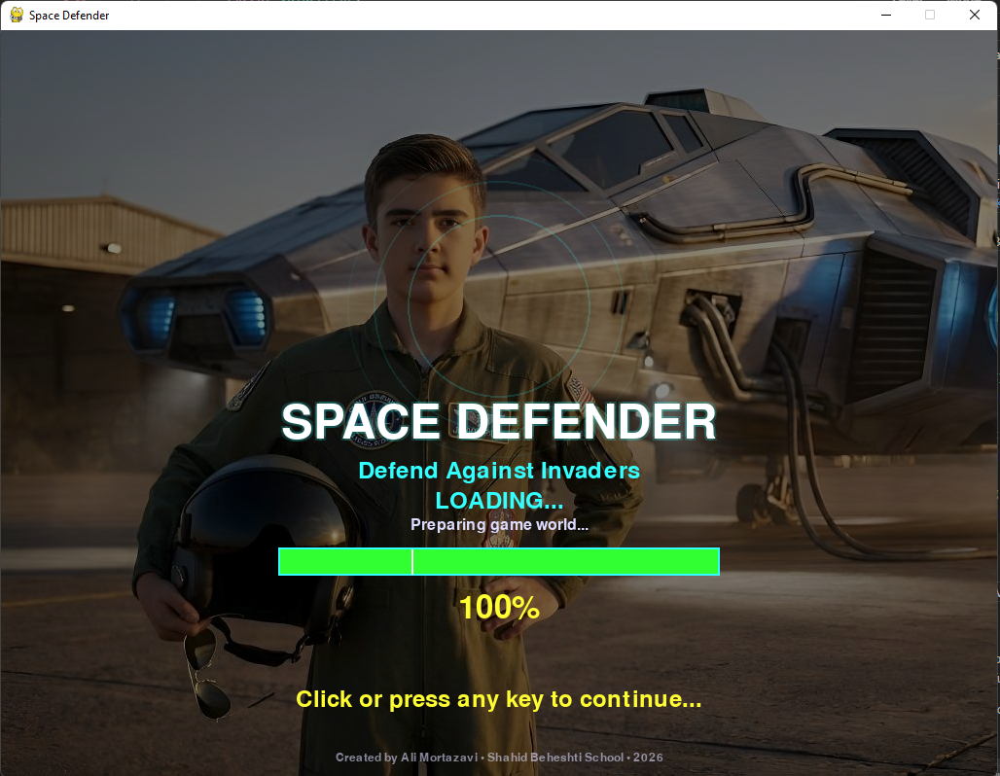
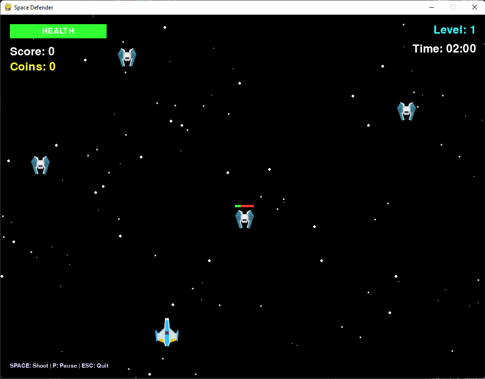
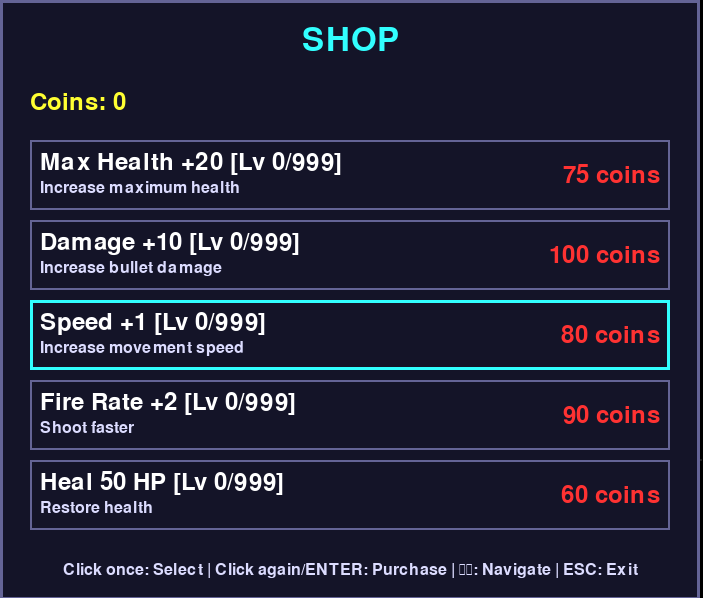
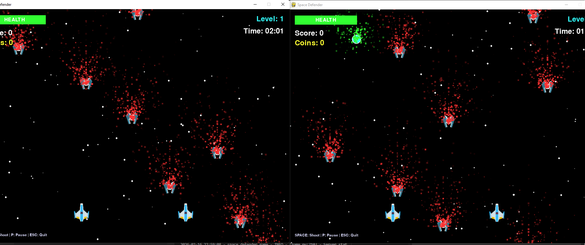

# 🚀 Space Defender

A fast-paced, action-packed space shooter game built with Python and Pygame. Defend your ship against waves of enemies, collect power-ups, and unlock new weapons in this thrilling arcade-style adventure!

**Version:** 2.1  
**Developer:** Ali Mortazavi

---

## 📋 Game Overview

Space Defender is a classic-style shoot-em-up game where you pilot a spaceship through increasingly difficult levels. Destroy enemies, avoid their attacks, and make strategic use of power-ups and weapons to survive as long as possible. Challenge yourself solo or cooperate with a friend in multiplayer mode!

### Key Features

- **Single Player & Multiplayer Co-op**: Play solo or with a friend on the same network
- **Progressive Difficulty**: Each level introduces more enemies and faster-paced combat
- **Weapon Arsenal**: Multiple weapon types with unique fire patterns and power-ups
- **Shop System**: Earn coins and upgrade your weapons and health between levels
- **Player Profiles**: Save your progress and compete for high scores
- **Smooth Gameplay**: Optimized 30 FPS performance with responsive controls
- **Professional Logging**: Detailed server-side logging with configurable verbosity

---

## 🎮 Game Features

### Gameplay Modes

#### 1. **Single Player Mode**
Solo adventure through progressively harder levels. Perfect for practicing and achieving high scores.

#### 2. **Multiplayer Mode (Local Network)**
Co-op gameplay with a friend. Connect via network and work together to survive enemy waves.

#### 3. **Server Mode**
Run a dedicated server that clients can connect to. Ideal for LAN play or testing multiplayer mechanics.

---

## 📸 Screenshots

### Splash Screen
  
The welcoming introduction screen where players start their journey.

### Simple Weapon
  
The basic single-shot weapon - reliable and straightforward for taking down enemies.

### Triple Shot Weapon
  
An upgraded weapon configuration that fires three projectiles simultaneously for increased damage output.

### Shop Interface
  
Purchase and upgrade your weapons, increase your health, and prepare for the next level using coins earned in combat.

### Network Mode
  
Connect with other players for cooperative multiplayer gameplay over the network.

---

## 🎮 How to Play

### Controls

| Action | Key |
|--------|-----|
| Move Left | `A` |
| Move Right | `D` |
| Move Up | `W` |
| Move Down | `S` |
| Shoot | `SPACE` |
| Pause | `P` |
| Quit Game | `ESC` |

### Game Mechanics

1. **Destroy Enemies**: Shoot incoming enemies to earn points and coins
2. **Collect Power-ups**: Grab floating power-ups to enhance your weapons
3. **Level Progression**: Complete each level by defeating all enemies
4. **Shop Management**: Use coins to upgrade weapons and health
5. **Score Tracking**: Beat your high score across multiple playthroughs

### Enemy Types

Different enemy variants with unique behaviors:
- **Basic Enemies**: Standard enemies with moderate health
- **Fast Enemies**: Swift, evasive targets that are harder to hit
- **Tough Enemies**: High-health enemies that take more damage

### Weapons

- **Simple**: Single shot - steady and reliable
- **Triple Shot**: Three bullets per trigger - increased coverage
- **More to unlock**: Discover additional weapon types in the shop

---

## 🚀 Getting Started

### Prerequisites

- Python 3.7 or higher
- Pygame 2.0+

### Installation

```bash
# Navigate to the game directory
cd space_defender

# Install dependencies
pip install pygame

# (Optional) Install test dependencies
pip install pytest
```

### Running the Game

#### Single Player Mode
```bash
python main.py
```

#### Multiplayer Client (Connect to Server)
```bash
python main.py --host 127.0.0.1 --port 35555
```

#### Dedicated Server
```bash
python server.py 35555
python server.py 35555 -v 1        # With verbosity (0-3)
```

---

## 📊 Game Statistics

- **Screen Resolution**: 1024 × 768 pixels
- **Frame Rate**: 30 FPS
- **Time Limit per Level**: 120 seconds
- **Starting Coins**: 0
- **Level Coin Bonus**: 100 coins upon completion
- **Max Players**: 2 (multiplayer mode)

---

## 📁 Project Structure

```
space_defender/
├── main.py                 # Game entry point
├── server.py              # Dedicated multiplayer server
├── core/
│   ├── game.py            # Core game logic
│   └── state_machine.py   # Game state management
├── entities/
│   ├── player.py          # Player ship
│   ├── enemy.py           # Enemy behavior
│   ├── bullet.py          # Projectiles
│   └── powerup.py         # Power-ups
├── systems/
│   ├── network.py         # Multiplayer networking
│   ├── asset_manager.py   # Asset loading
│   ├── collision_system.py# Collision detection
│   ├── particle_system.py # Visual effects
│   └── save_system.py     # Profile management
├── ui/
│   ├── menus.py           # Menu screens
│   ├── hud.py             # In-game HUD
│   └── widgets.py         # UI widgets
├── config/
│   └── settings.py        # Centralized configuration
├── assets/
│   ├── sprites/           # Game graphics
│   └── sounds/            # Audio files
├── tests/                 # Test suite
└── misc/                  # Additional assets (screenshots)
```

---

## 🧪 Testing

Run the test suite to verify game functionality:

```bash
# Run all tests
pytest

# Run with verbose output
pytest -v

# Run specific test file
pytest tests/gameplay/
```

All 12 core tests validate game mechanics, networking, and integration scenarios.

---

## 🔧 Server Verbosity Control

Control server output with the `-v` flag:

```bash
python server.py 35555 -v 0     # Silent (errors only)
python server.py 35555 -v 1     # Low (default - connections & events)
python server.py 35555 -v 2     # Medium (+ network details)
python server.py 35555 -v 3     # High (all debug info)
```

---

## 🎯 Gameplay Tips

1. **Stay Mobile**: Keep moving to avoid enemy fire
2. **Strategic Upgrades**: Prioritize weapon upgrades that match your playstyle
3. **Manage Resources**: Balance weapon purchases with health upgrades
4. **Co-op Strategy**: Coordinate with your partner to cover more ground
5. **Pattern Recognition**: Learn enemy movement patterns to predict attacks

---

## 🐛 Known Issues & Future Enhancements

- More weapon types and special abilities
- Leaderboard persistence across sessions
- Advanced particle effects
- Boss battles on certain levels
- Customizable controls and graphics settings

---

## 📝 License

Created by Ali Mortazavi for Kharazmi High School.

---

## 🤝 Contributing

Contributions, bug reports, and feature suggestions are welcome!

---

**Enjoy the game and defend your space! 🚀**
